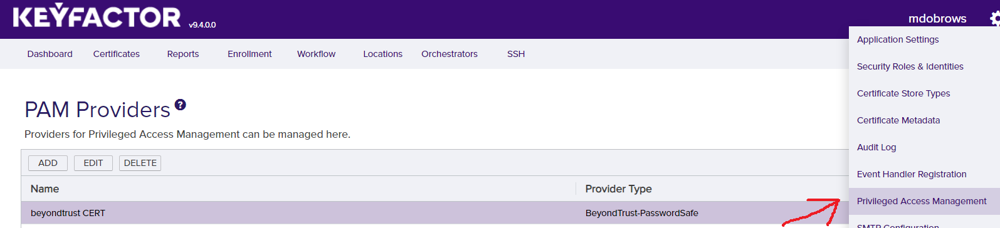
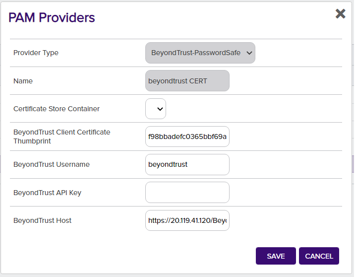
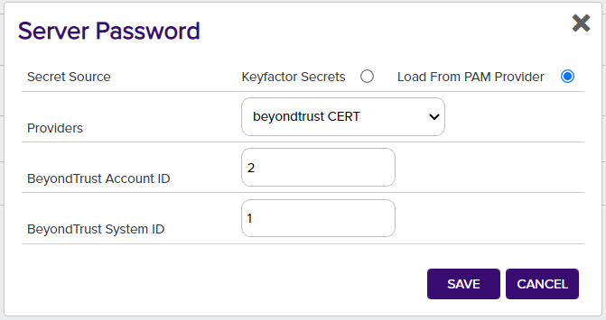

# BeyondTrust Password Safe

The BeyondTrust Password Safe PAM Provider allows for the retrieval of stored account credentials from the Password Safe solution. A valid API registration in BeyondTrust is used to open a request and retrieve credentials for a given account on a system.

#### Integration status: Production - Ready for use in production environments.

## About the Keyfactor PAM Provider

Keyfactor supports the retrieval of credentials from 3rd party Privileged Access Management (PAM) solutions. Secret values can normally be stored, encrypted at rest, in the Keyfactor Platform database. A PAM Provider can allow these secrets to be stored, managed, and rotated in an external platform. This integration is usually configured on the Keyfactor Platform itself, where the platform can request the credential values when needed. In certain scenarios, a PAM Provider can instead be run on a remote location in conjunction with a Keyfactor Orchestrator to allow credential requests to originate from a location other than the Keyfactor Platform.


## Support for BeyondTrust Password Safe

BeyondTrust Password Safe is supported by Keyfactor for Keyfactor customers. If you have a support issue, please open a support ticket with your Keyfactor representative.

###### To report a problem or suggest a new feature, use the **[Issues](../../issues)** tab. If you want to contribute actual bug fixes or proposed enhancements, use the **[Pull requests](../../pulls)** tab.
___


---


---


### Initial Configuration of PAM Provider
In order to allow Keyfactor to use the new BeyondTrust-PasswordSafe PAM Provider, the definition needs to be added to the application database.
This is done by running the provided [add_PAMProvider.sql](./PasswordSafe/add_PAMProvider.sql) script on the Keyfactor application database, which only needs to be done one time.

If you have a hosted environment or need assistance completing this step, please contact Keyfactor Support.

### Configuring Parameters
The following are the parameter names and a description of the values needed to configure the Beyond Trust Password Safe PAM Provider.

| Initialization parameter | Display Name | Description | Instance parameter | Display Name | Description |
| :---: | :---: | --- | :---: | :---: | --- |
| Host | BeyondTrust Host | The IP address or URL of the BeyondTrust instance, including the API endpoint (default endpoint: BeyondTrust/api/public/v3/) | SystemId | BeyondTrust System ID | The ID of the system that holds the requested credential |
| APIKey | BeyondTrust API Key | The base64 encode API registration key from BeyondTrust | AccountId | BeyondTrust Account ID | The ID of the account on the system, whose password will be retrieved |
| Username | BeyondTrust Username | The username that the API request will be run as. This user needs to have sufficient permissions on the API key and the credentials to request | IsAWSAccessKey | Is an AWS Access Key | (OPTIONAL) If set, will interpret the credential retrieved as a concatenated AWS Access Key and Secret Key, and retrieve the first part before a separator (' ', ':', ';') |
| ClientCertificate | BeyondTrust Client Certificate Thumbprint | (OPTIONAL) The thumbprint for a client certificate to authenticate with BeyondTrust. Can be blank. Certificate should be present with exportable private key in the User's Personal store. | IsAWSSecretKey | Is an AWS Secret Key | (OPTIONAL) If set, will interpret the credential retrieved as a concatenated AWS Access Key and Secret Key, and retrieve the second part after a separator (' ', ':', ';') |


### Configuring for PAM Usage
#### In Beyond Trust
The Beyond Trust platform needs to be configured to allow for API requests to retrieve credentials for the systems and accounts necessary.
In the Web Console, the Configuration section API Registrations will allow an API Key to be generated for a user, as well as specify if a Client Certificate will be required.
The user that gets assigned this API Key should not be the default Administrator, and they will also need to be granted access to retrieve Credentials from the appropriate accounts in the User Management section.
If using a Client Certificate, this will need to be exported from the Beyond Trust platform itself or issued from a properly configured PKI that the platform trusts.
If you are not using a Client Certificate, enter whitespace into this field during configuration.

After defining the necessary Functional Account to handle Managed System actions and administration, a Managed System can be defined and then a Managed Account with a Credential added.
You will need to get the IDs for the Account and System to use them in Keyfactor. In order to obtain these, start by going to the "Managed System" or "Managed Accounts" area in Beyond Trust. Find the relevant system or account you are looking for, and click the 3-dot options on the far-right, and go to the "Advanced Details". The ID number will show up in the URL field after opening the Advanced Details.

#### In Keyfactor - PAM Provider
##### Installation
In order to setup a new PAM Provider in the Keyfactor Platform for the first time, you will need to run [the SQL Installation Script](./PasswordSafe/add_PAMProvider.sql) against your Keyfactor application database.

Take note, that when defining the PAM Provider you can choose to include parameters that are meant for special handling of AWS Credentials. This definition should be used if PAM instances will be configured that will retrieve AWS Credentials.

After the installation is run, the DLLs need to be installed to the correct location for the PAM Provider to function. From the release, the `PasswordSafe.dll` should be copied to the following folder locations in the Keyfactor installation. Once the DLL has been copied to these folders, edit the corresponding config file. You will need to add a new Unity entry as follows under `<container>`, next to other `<register>` tags.

When enabling a PAM provider for Orchestrators only, the first line for `WebAgentServices` is the only installation needed.

The Keyfactor service and IIS Server should be restarted after making these changes.

```xml
<register type="IPAMProvider" mapTo="Keyfactor.Extensions.Pam.BeyondInsight.PasswordSafe.PasswordSafePAM, PasswordSafe" name="BeyondTrust-PasswordSafe" />
```

| Install Location | DLL Binary Folder | Config File |
| --- | --- | --- |
| WebAgentServices | WebAgentServices\bin\ | WebAgentServices\web.config |
| Service | Service\ | Service\CMSTimerService.exe.config |
| KeyfactorAPI | KeyfactorAPI\bin\ | KeyfactorAPI\web.config |
| WebConsole | WebConsole\bin\ | WebConsole\web.config |

##### Usage
In order to use the PAM Provider, the provider's configuration must be set in the Keyfactor Platform. In the settings menu (upper right cog) you can select the ___Priviledged Access Management___ option to configure your provider instance.





After it is set up, you can now use your PAM Provider when configuring certificate stores. Any field that is treated as a Keyfactor secret, such as server passwords and certificate store passwords can be retrieved from your PAM Provider instead of being entered in directly as a secret.



